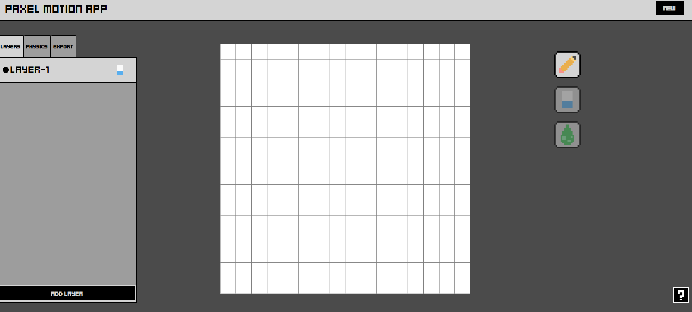

# 🎨 Paxel Motion Framework

A lightweight **pixel art** and **environment simulation** framework for HTML Canvas, perfect for retro‑style visuals and smooth motion design animations.


## ✨ Features

- 🖌 **Pixel‑perfect rendering** for authentic retro aesthetics
- 🌦 **Environment simulation**: forces, collisions and physics
- 🧩 Modular API for drawing, animating, and composing scenes
- ⚡ Optimized for performance in modern browsers with webgl
- 📦 Typescript with zero runtime dependencies

## 🚀 Projects

Here will be listed all the known applications using this framework in any creative way:
- 🎨 **Paxel Motion App** : a free drawing and motion graphics pixel art application, to let everyone experiment with retro visuals and imagination. Is developed and maintained by the same developer of the framework. Give it a try: [Paxel Motion App](https://paxelmotionapp.com/).


---

## 📥 Installation & Build

This library is **not published on npm**. You can install it in two ways:

1. **Clone and build manually**
   ```bash
   git clone https://github.com/fpetcast/paxel-motion-framework
   cd paxel-motion-framework
   npm install
   npm run build
   ```
2. **Download the build folder directly** :
   the build folder is updated with the latest stable release.
   Copy it directly into your project and import from there.

The **build** folder contains the index file of the library, the minified version and the .d.ts for types.

---

## 💾 Usage

### 📋 Configuration

For an immediate start you can just import the renderer class and initialize
with a canvas html

```typescript
import { PaxelRenderer } from "./build";
const canvas = document.createElement("canvas");
document.body.appendChild(canvas);

const paxelRenderer = new PaxelRenderer(canvas);
```

For advanced configuration, you can import the type to pass optional config object as second
argument to the class

```typescript
import { PaxelRenderer, type PaxelRendererConfig } from "./build";

const canvas = document.createElement("canvas");
document.body.appendChild(canvas);

export const config: PaxelRendererConfig = {
  init: true, // initialize without calling the init method
  canExport: true, // let you export frames
  canvas: {
    width: 640, // will set canvas width
    height: 640, // will set canvas height
  },
  grid: {
    rows: 16, // number of rows
    columns: 16, // number of columns
  },
};

const paxelRenderer = new PaxelRenderer(canvas, config);
```

### 🎇 Rendering

Now let's begin to draw something on the screen: calling this function
after initialization to display a frame border around the canvas.

```typescript
function effect = (
  paxelRenderer: PaxelRenderer,
  config: PaxelRendererConfig,
  intervalDuration: number = 100,
  color: string = "#000000" //rgba or hex color
)  {
  const maxX = config.grid.rows;
  const maxY = config.grid.columns;
  let x = 0;
  let y = 0;

  const interval = setInterval(() => {
    if (x < maxX) {
      paxelRenderer.putPixel(x, 0, color);
      paxelRenderer.putPixel(maxX - x, maxY - 1, color);
      x++;
    }

    if (y < maxY) {
      paxelRenderer.putPixel(0, y, color);
      paxelRenderer.putPixel(maxX - 1, maxY - y, color);
      y++;
    }

    if (y >= maxX && x >= maxX) {
      clearInterval(interval);
    }
  }, intervalDuration);
}
```

Using **putPixel** method we can show pixels at specific positions
based on the grid defined in configuration.

It's also possible to draw using the position in pixel relative to
the screen, for example detecting the click and draw pixels
at grid positions using **drawAt** method

```typescript
import { PaxelRenderer } from "./build";
const canvas = document.createElement("canvas");
document.body.appendChild(canvas);

const paxelRenderer = new PaxelRenderer(canvas);
const selectedColor = "#000000";
canvas.addEventListener("click", (e) => {
  paxelRenderer.drawAt(e.offsetX, e.offsetY, selectedColor);
});
```

### 📚 Layers
By default all the pixels will be drawn on the same layer, but
there is a **stack mechanism** to create overlays and complex backgrounds
using  **layers**. You can add a layer with a given name using **addLayer**
and use it as the new active layer with **setActiveLayer**

```typescript
const newLayerName = "above-default-layer";
paxelRenderer.addLayer(newLayerName);
paxelRenderer.setActiveLayer(newLayerName);
```

This way you can set the active layer where the pixels wil be put from
now on. There are other common features relative to these structure like
**getLayers** to get the names of all registered layers or **removeLayer**
to remove them by name

```typescript
const removeLayerName = "remove-me";
paxelRenderer.removeLayer(removeLayerName);
```

Another important feature of layers is that they can be cleared from
all the pixels rendered on them. To clear a single layer, just call
**clearLayer** method, but as a good shortcut to completely clear
the frame **clearAllLayers** should do the trick.

```typescript
const clearLayerName = "clear-me";
paxelRenderer.clearLayer(clearLayerName);

// this should remove all pixels from the frame and layers
paxelRenderer.clearAllLayers();
```

### 👾 Physics
One of the coolest things you can do is to make static objects
start moving, like a magician, or nowadays like animators.

The frameworks supports an **animation loop** that can be controlled
as you like using three methods.

```typescript
paxelRenderer.play(); // start physics simulation
paxelRenderer.stop(); // stop physics simulation
paxelRenderer.restart(); // restart physics simulation from original positions
```

But playing a physics simulation will involve to register **forces**
and possibly **loops**, to see all the pixels on the specified layers moving with a pattern.

Start simple, set a **force** on the renderer, this by default will only create
the **vector** which will be **added to the position** of the layers. Only the **layers**
that are **subscribed to the force** will be impacted when playing the simulation.

```typescript
// this will create a force in the simulation with the specificed vector and a name
const force = {
  x: 1,
  y: 0
};
paxelRenderer.createForce(force.name, force);

// create a layer or register one yet created to the force
const movingLayer = "moving-layer"
paxelRenderer.applyForce(movingLayer);

paxelRenderer.play(); // to see the force in action
```

You can also define the target **FPS** (but really always depends on the web browser),
and the **loop time**. Applying the loop on specific layers will trigger 
a **restart** for all the pixels involved, that will return to the **original positions** 
like in an animation cycle.

```typescript
// maxFps set to 30
let fps = 15;
paxelRenderer.setFPS(fps);

// define the loop time in seconds
let seconds = 2;
paxelRenderer.setLoopTime(seconds);

const loopedLayer = "looped-layer"
paxelRenderer.applyLoop(loopedLayer);

paxelRenderer.play(); // to see the layer looping cycle
```